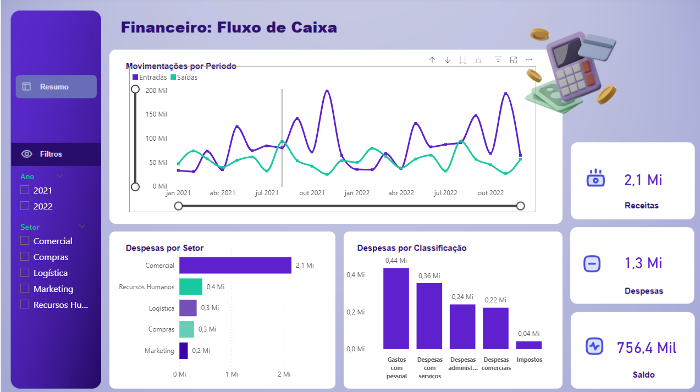

# Dashboard: Financeiro

Este dashboard analisa as entradas e saídas de uma empresa.

## 📌 Destaques:
- Movimentação por período
- Despesas por Classificação
- Despesas por Setor

## 📁 Arquivos
- `Dash Financeiro.pbix`: arquivo original do Power BI.
- `dash-financeiro.png`: imagem de visualização do dashboard.

