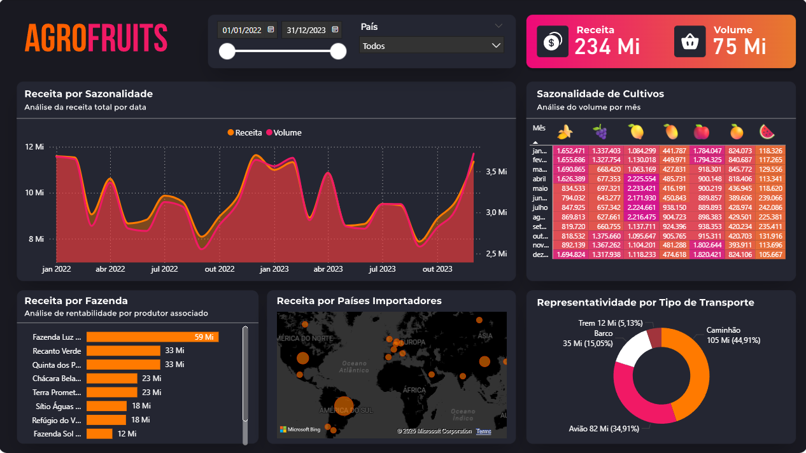

# Dashboard: Venda de frutas

Este dashboard analisa a venda de frutas entre 2022-2023.

## 📌 Destaques:
- Mapa da receita por países 
- Volume de cultivos por mês(sazonalidade)
- Receita por Sazonalidade

## 📁 Arquivos
- `Dash Vendas.pbix`: arquivo original do Power BI.
- `dash-vendas.png`: imagem de visualização do dashboard.

